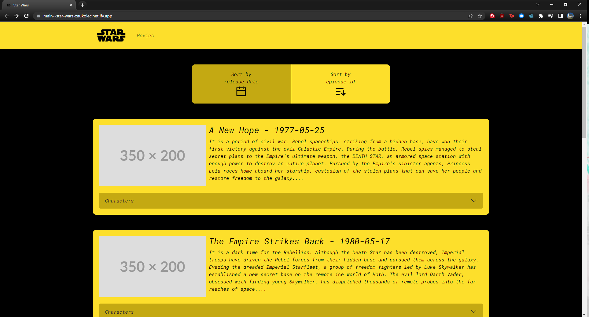
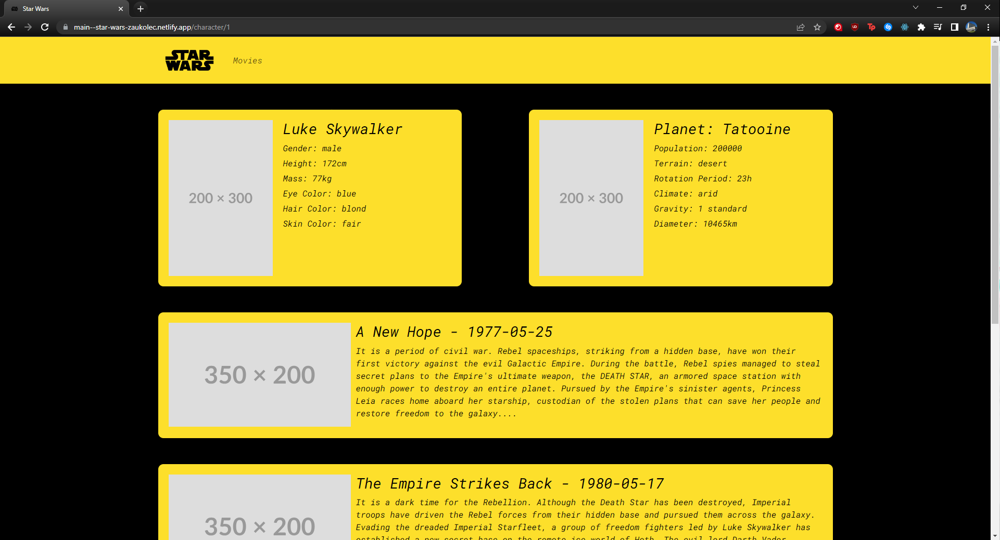

# Star Wars App

## App is running live on - https://main--star-wars-zaukolec.netlify.app/

- Technologies: React, Typescript
- this is just information: SWAPI is kinda slow ... even if i try sending request through insomnia, sometimes the responses takes 20 seconds

## App init

- npm install
- npm start

